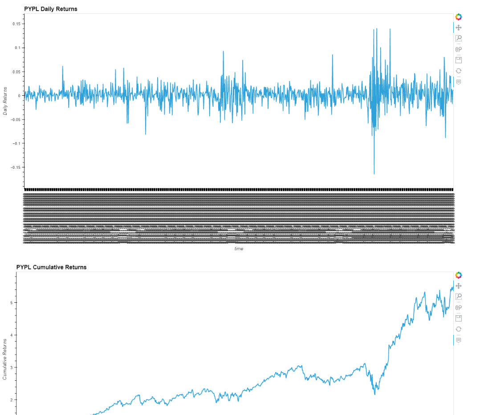
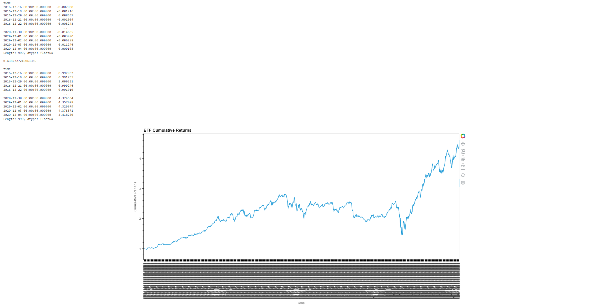

# ETF Portfolio Analysis
This study analysed the returns of an ETF portfolio that were stored in SQL database. The analysis was then ran in a voila webapp and displayed as follows:

# Dependencies
pandas, hvplot, numpy and sqlalchemy were used in this analysis

